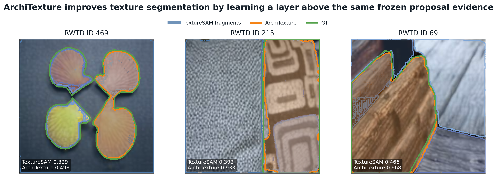
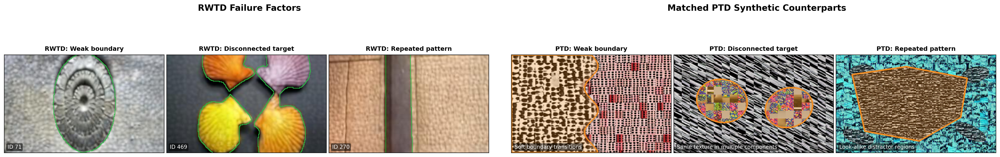
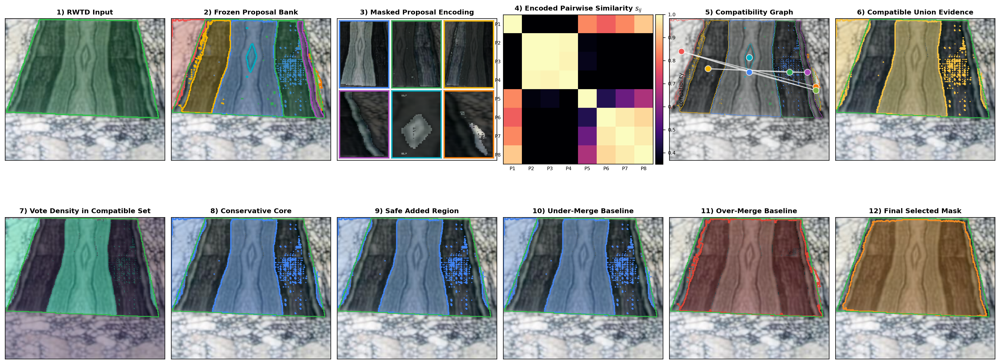
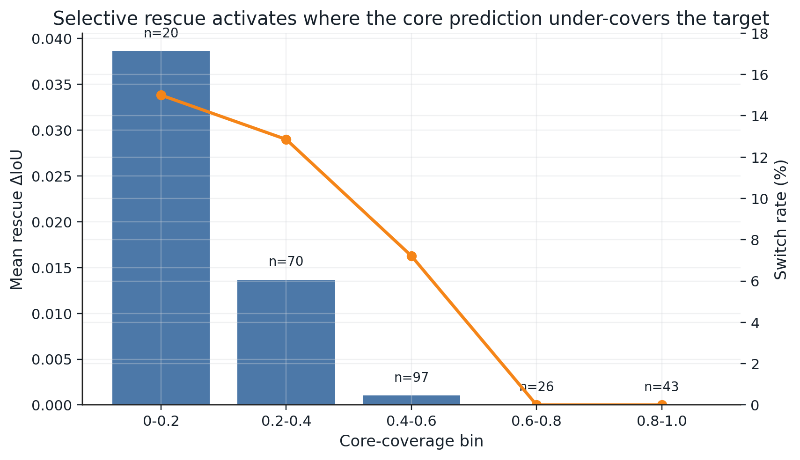
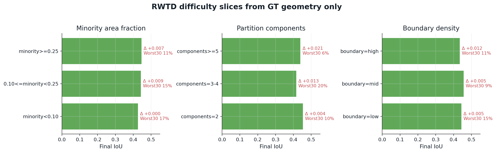

# ArchiTexture

**Paper title:** *Real-World Texture Segmentation by Consolidating Fragmented Evidence*

ArchiTexture is a frozen-proposal texture-segmentation framework: it keeps the proposal engine fixed, learns compatibility-aware consolidation above the proposal bank, and evaluates that decision layer across real, synthetic, bridge, and domain-specific routes.

## Important Repository Note

This repository is now documented as the **public paper entrypoint**.

- The exact local paper experiment workspace used in this archive lives in `../TextureSAM-v2`.
- The manuscript package lives in `../TextureSAM-v2/TextureSum2_paper`.
- The official evaluator and SAM2 source used by the paper live in `../TextureSAM_upstream_20260303`.
- The public galleries referenced by the manuscript live in `../rwtd_miner_public_site`.
- The full route-to-script and artifact map is in [PAPER_REPRODUCIBILITY.md](PAPER_REPRODUCIBILITY.md).

This repo still contains the RWTD-mining/review code under `rwtd_miner/` and the bundled static review site under `docs/review/`, but the README below is intentionally **paper-first** so the project is understandable without digging through terminal history.

## Quick Links

- Paper reproducibility map: [PAPER_REPRODUCIBILITY.md](PAPER_REPRODUCIBILITY.md)
- Local static review bundle in this repo: `docs/review/index.html`
- Public ArchiTexture results hub: `https://scientific-computing-user.github.io/rwtd-texture-miner-site/`
- Public code repo: `https://github.com/scientific-computing-user/ArchiTexture`
- Public gallery repo: `https://github.com/scientific-computing-user/rwtd-texture-miner-site`

## Project At A Glance



ArchiTexture is built around four ideas:

1. Keep the proposal source fixed so gains are attributable to the consolidation layer rather than a stronger segmentation backbone.
2. Train the decision layer from scalable synthetic supervision instead of fitting RWTD labels.
3. Evaluate the same formulation across four routes: RWTD, STLD, ControlNet-stitched PTD, and CAID.
4. Report both coverage-like behavior and partition consistency, because texture segmentation failures are often commitment failures rather than proposal-recall failures.

## Main Reported Results

The paper uses different metric views depending on the route. The table below lists the primary view used for the main comparison in the current local artifact bundle.

| Route | Primary evaluation view | ArchiTexture | Comparator | Coverage note |
| --- | --- | --- | --- | --- |
| RWTD | Official no-agg, common-253 matched rerun | `0.4645 / 0.7013` | TextureSAM `0.4684 / 0.6163` | matched on the exact 253 IDs where the reproduced TextureSAM export emits masks |
| RWTD | Official no-agg, full-256 release | `0.4611 / 0.6966` | n/a | full released ArchiTexture export |
| STLD | Direct foreground, all-200 | `0.6705 / 0.7249` | TextureSAM `0.4677 / 0.6849` | ArchiTexture covers all 200 images; TextureSAM covers 182 |
| ControlNet-stitched PTD | Partition-invariant, all-1742 | `0.6803 / 0.6039` | TextureSAM `0.6425 / 0.5510` | ArchiTexture covers all 1742 images; TextureSAM covers 1739 |
| CAID | Partition-invariant, all-3104 | `0.6677 / 0.5745` | TextureSAM `0.6691 / 0.5080` | ArchiTexture covers all 3104 images; TextureSAM covers 3063 |

Values are shown as `mIoU / ARI`.

## Core Figures

### Real-to-synthetic supervision bridge



This figure captures the paper's supervision logic: RWTD is the evaluation target, PTD supplies scalable synthetic supervision, and the synthetic curriculum is shaped to reflect the real failure factors that matter on RWTD.

### Consolidation logic above a frozen proposal bank



The main claim is architectural rather than cosmetic: the gain comes from compatibility reasoning, conservative core extraction, and selective repair above a fixed proposal bank.

### Where the RWTD gain comes from



The gain is not uniformly distributed. It is concentrated on the low-coverage failure slice where rescue is actually needed.

### Difficulty slices on RWTD



The error profile is organized by GT geometry rather than just headline score, which makes the remaining failure modes easier to inspect and reproduce.

## Exact Local Artifact Layout Used For The Paper

If you are working inside the same workspace/archive as this repo, these are the paths that matter:

- `../TextureSAM-v2`
  Main paper experiment workspace and the source of truth for the route-specific experiments.
- `../TextureSAM-v2/TextureSum2_paper`
  Manuscript source, paper figures, paper tables, Overleaf exports, and release-ready JSON/CSV artifacts.
- `../TextureSAM_upstream_20260303`
  Official `eval_no_agg_masks.py` evaluator and upstream SAM2 code used for reproduced baseline inference/evaluation.
- `../rwtd_miner_public_site`
  Public GitHub Pages galleries referenced by the paper footnotes.
- `./rwtd_miner`
  The mining/review pipeline retained in this repo.

## Minimal Rebuild Commands

If the companion workspace `../TextureSAM-v2` exists, the following commands rebuild the main paper-side summaries from archived outputs:

```bash
python ../TextureSAM-v2/scripts/build_strong_accept_audit.py
python ../TextureSAM-v2/scripts/build_e2e_subset_report.py
python ../TextureSAM-v2/scripts/build_reviewer_mitigation_pack.py
python ../TextureSAM-v2/scripts/build_release_appendix_tables.py
python ../TextureSAM-v2/scripts/build_reviewer_followup_pack.py
python ../TextureSAM-v2/scripts/build_rwtd_difficulty_breakdown.py
```

To recompute the official RWTD score for the released full-256 ArchiTexture export:

```bash
python ../TextureSAM-v2/scripts/eval_upstream_texture_metrics.py \
  --pred-folder ../TextureSAM-v2/reports/release_swinb_full256_audit/official_export \
  --gt-folder ../TextureSAM_upstream_20260303/Kaust256/labeles \
  --upstream-root ../TextureSAM_upstream_20260303 \
  --out-json ../TextureSAM-v2/reports/release_swinb_full256_audit/official_eval_full256.json
```

To recompute the strict matched RWTD comparison against the reproduced TextureSAM export:

```bash
python ../TextureSAM-v2/scripts/eval_upstream_texture_metrics.py \
  --pred-folder ../TextureSAM-v2/reports/release_swinb_full256_audit/official_export_common253 \
  --gt-folder ../TextureSAM_upstream_20260303/Kaust256/labeles \
  --upstream-root ../TextureSAM_upstream_20260303 \
  --out-json ../TextureSAM-v2/reports/release_swinb_full256_audit/official_eval_common253.json
```

For the full route-by-route script map, archived output roots, and figure builders, see [PAPER_REPRODUCIBILITY.md](PAPER_REPRODUCIBILITY.md).

## Route Summary

| Route | Companion workspace root | Main entrypoints |
| --- | --- | --- |
| RWTD | `../TextureSAM-v2/reports/release_swinb_full256_audit` and `../TextureSAM-v2/reports/strict_ptd_*` | `run_official_texturesam_inference.py`, `run_strict_ptd_v3.py`, `run_strict_ptd_v8_partition.py`, `run_strict_ptd_v7_dualgate.py`, `run_strict_ptd_v9_v7_v8_gate.py`, `run_strict_ptd_v11_dense_rescue.py` |
| STLD | `../TextureSAM-v2/experiments/khan_synthetic_gallery_20260312` | `build_khan_synthetic_benchmark.py`, `run_gallery.sh`, `eval_stld_direct.py`, `publish_khan_synthetic_gallery.py` |
| ControlNet-stitched PTD | `../TextureSAM-v2/experiments/perlin_controlnet_eval_20260312` | `run_stagea_hi_eval.sh`, `eval_binary_partition_maskbank.py`, `publish_controlnet_stitched_gallery.py` |
| CAID | `../TextureSAM-v2/experiments/caid_eval_20260313` | `build_caid_binary_benchmark.py`, `run_stagea_eval.sh`, `eval_binary_partition_maskbank.py`, `publish_caid_gallery.py` |

## Public Artifacts

- RWTD gallery: `https://scientific-computing-user.github.io/rwtd-texture-miner-site/texturesam2_ai_gallery/index.html`
- STLD gallery: `https://scientific-computing-user.github.io/rwtd-texture-miner-site/khan_synthetic_gallery/`
- ControlNet-stitched PTD gallery: `https://scientific-computing-user.github.io/rwtd-texture-miner-site/controlnet_stitched_gallery/`
- CAID gallery: `https://scientific-computing-user.github.io/rwtd-texture-miner-site/caid_gallery/`
- Static review bundle stored in this repo: `docs/review/index.html`

## What This Repo Still Contains

The code in this checkout is still useful, but it is not the whole paper workspace:

- `rwtd_miner/`
  Resumable mining/review pipeline for RWTD-like texture-transition images from dense segmentation datasets.
- `docs/review/`
  A bundled static review site generated from that pipeline.
- `scripts/`
  Bootstrap, server, publishing, and dataset-preparation helpers for the mining/review pipeline.

That legacy content is kept intact because it remains part of the broader ArchiTexture artifact story, but the paper-facing experiment source of truth for this local archive is the companion `../TextureSAM-v2` workspace documented in [PAPER_REPRODUCIBILITY.md](PAPER_REPRODUCIBILITY.md).
