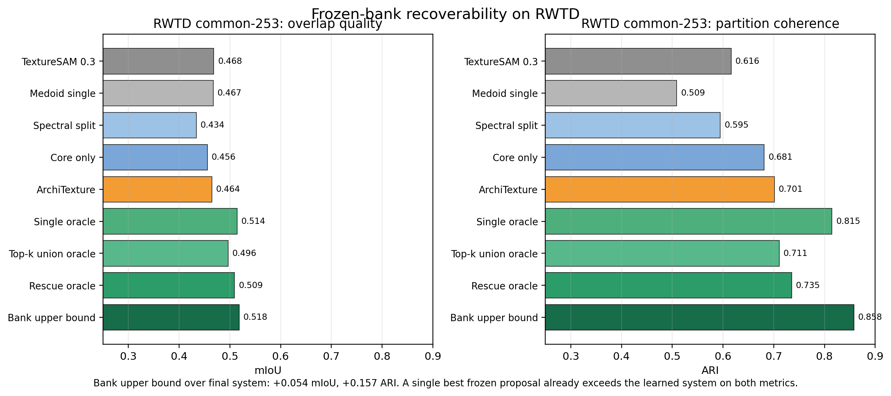

# ArchiTexture

<p align="center">
  <strong>Recovering Texture Partitions from Frozen SAM via Proposal-Space Commitment</strong>
</p>

<p align="center">
  Paper-first code and artifact release for the ArchiTexture NeurIPS submission.
</p>

<p align="center">
  <a href="paper/main.pdf"><strong>Paper PDF</strong></a>
  ·
  <a href="paper/main.tex"><strong>LaTeX Source</strong></a>
  ·
  <a href="reproducibility/REPRODUCE_MAIN_RESULTS.md"><strong>Reproduce Main Results</strong></a>
  ·
  <a href="reproducibility/REPRODUCE_APPENDIX.md"><strong>Reproduce Appendix</strong></a>
  ·
  <a href="results/RESULTS_MANIFEST.md"><strong>Results Manifest</strong></a>
</p>

<p align="center">
  
</p>

ArchiTexture studies texture segmentation in frozen SAM-style systems as a recoverability problem. The paper's core claim is narrower, and more operational, than generic texture adaptation: a large part of the missing performance is not new backbone texture knowledge, but texture partition commitment above a fragmented frozen proposal bank.

This repository is intentionally paper-first. It packages the final manuscript, the core `texturesam_v2` proposal-space implementation, the in-scope experiment scripts, and the retained summary artifacts behind the final tables and appendix diagnostics.

## Why This Paper Is Interesting

- **Frozen evidence can be strong but unusable.** SAM-style proposal banks often contain the right pieces for texture segmentation, but they do not commit them into coherent texture partitions.
- **The hard case is not the same on every benchmark.** RWTD behaves like a fragmented-evidence regime, while STLD often behaves like a singleton-selection regime.
- **The paper separates diagnostic evidence from operational evidence.** Feature-space recovery remains auxiliary. The main contribution is proposal-space commitment above the frozen bank.
- **The claim is backed by oracle analysis.** On RWTD, the learned system improves substantially over simple top-1 selection, yet the frozen bank still contains additional unrecovered value.

## Main Matched Results

Values are reported as `mIoU / ARI`.

| Benchmark | Evaluator / subset | Comparator | ArchiTexture | Reading |
| --- | --- | --- | --- | --- |
| RWTD | official invariant, common-253 | TextureSAM rerun `0.4684 / 0.6163` | **`0.4645 / 0.7013`** | Near-matched overlap, much stronger coherence |
| RWTD | official invariant, full-256 | SAM2.1-small rerun `0.1615 / 0.2183` | **`0.4611 / 0.6966`** | Large gain over the raw frozen baseline |
| STLD | direct foreground, common-182 | TextureSAM rerun `0.5140 / 0.7526` | **`0.7195 / 0.7791`** | Stronger overlap and modestly better coherence |
| STLD | direct foreground, all-200 | SAM2.1-small rerun `0.3686 / 0.5269` | **`0.6705 / 0.7249`** | Large gain in both views |

The main paper stays disciplined around **RWTD** and **STLD**. Feature-space recovery is diagnostic-only, and the ControlNet bridge and CAID remain appendix-only supporting routes.

## The Recoverability Story

<p align="center">
  
</p>

The RWTD oracle decomposition is the paper's key sanity check. It shows that the gain is not explained by lucky top-1 selection alone:

| RWTD common-253 method | mIoU | ARI |
| --- | ---: | ---: |
| Learned single selector | 0.4512 | 0.5601 |
| Core-only commitment | 0.4558 | 0.6812 |
| **ArchiTexture final** | **0.4645** | **0.7013** |
| Single frozen-proposal oracle | 0.5142 | 0.8146 |
| Bank upper bound | 0.5183 | 0.8580 |

That gap is the paper in one table: a frozen bank can already contain useful texture evidence, but extracting it requires more than selecting one attractive proposal.

## What Is Frozen, And What Is Learned

| Frozen | Learned |
| --- | --- |
| SAM-style proposal generator | proposal compatibility scoring |
| proposal bank itself | conservative component scoring and selection |
| feature probe backbone used in the auxiliary appendix | RWTD dense rescue layer |

The method therefore isolates decision-layer recoverability instead of burying the result inside a new end-to-end segmentation network.

## Repository Tour

| Path | Purpose |
| --- | --- |
| `paper/` | final manuscript source and compiled PDF |
| `texturesam_v2/` | core proposal-space package |
| `scripts/` | curated in-scope experiment, evaluation, and analysis scripts |
| `tests/` | lightweight package tests |
| `results/` | retained JSON/CSV summaries, manifest, and experiment ledger |
| `appendix_assets/` | standalone appendix figures and galleries |
| `reproducibility/` | shortest-path notes for rebuilding main and appendix artifacts |
| `data_docs/` | benchmark-role notes |
| `checkpoints_manifest/` | expectations for external checkpoints needed for full reruns |

## Quick Start

```bash
python -m venv .venv
source .venv/bin/activate
pip install -r requirements.txt
pip install -e .
python -m unittest discover -s tests -v
```

To rebuild the paper PDF:

```bash
cd paper
tectonic main.tex
```

## Fastest Audit Path

1. Read the paper: [paper/main.pdf](paper/main.pdf)
2. Verify where each figure and table comes from: [results/RESULTS_MANIFEST.md](results/RESULTS_MANIFEST.md)
3. Inspect the exact retained commands and output roots: [results/EXPERIMENT_LEDGER.md](results/EXPERIMENT_LEDGER.md)
4. Check the committed summary artifacts under `results/artifacts/`
5. Use [reproducibility/REPRODUCE_MAIN_RESULTS.md](reproducibility/REPRODUCE_MAIN_RESULTS.md) for the shortest path back to the main tables

## Scope Discipline

This public release follows the final paper scope exactly:

- **Main body:** RWTD and STLD
- **Auxiliary diagnostic evidence:** feature-space recovery from coarse frozen features
- **Appendix-only supporting routes:** ControlNet bridge and CAID
- **Not part of the main paper story:** DeTexture / Detector / ADE20K and AdaSam-style adaptor experiments

## Citation

If you use this repository, please cite the paper and repository metadata in [CITATION.cff](CITATION.cff).
